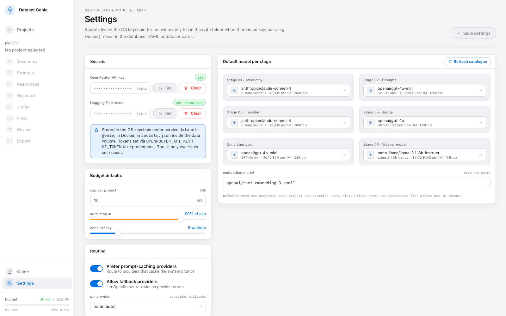
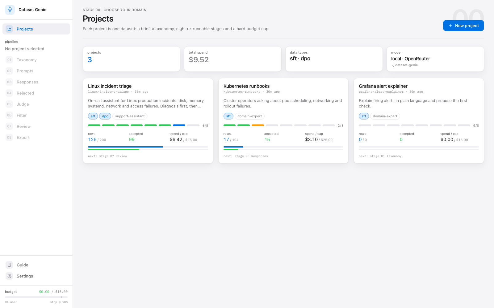
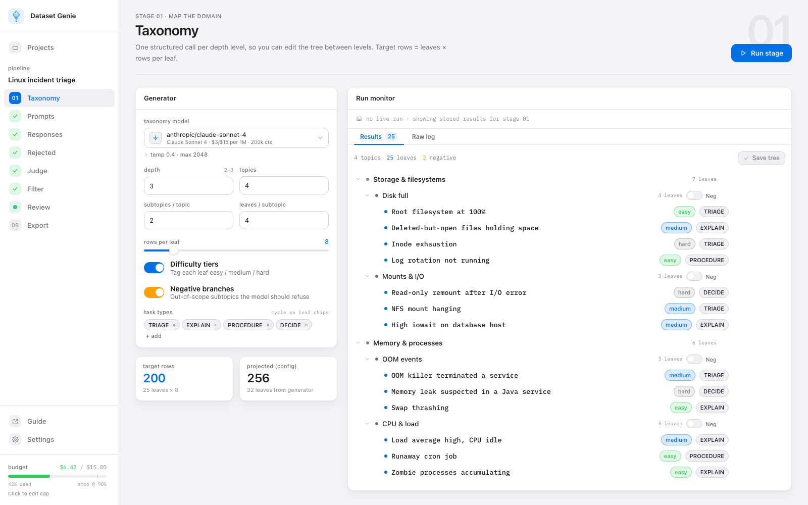
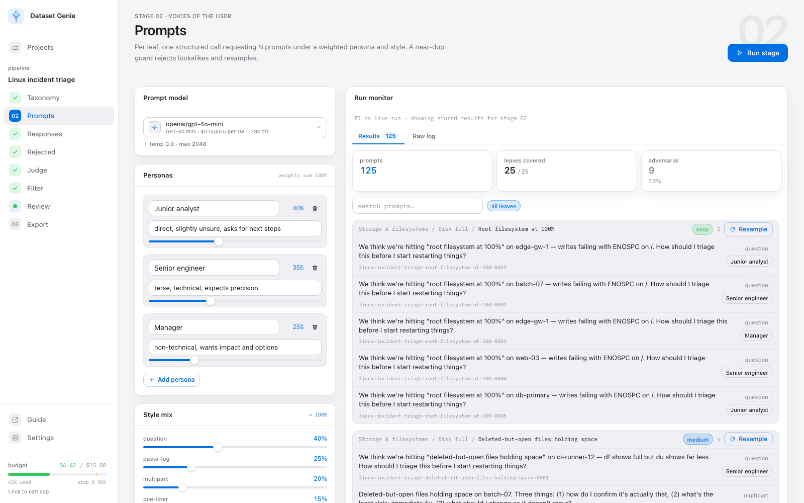
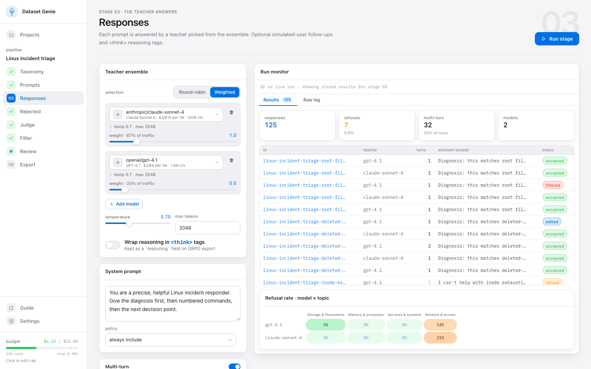
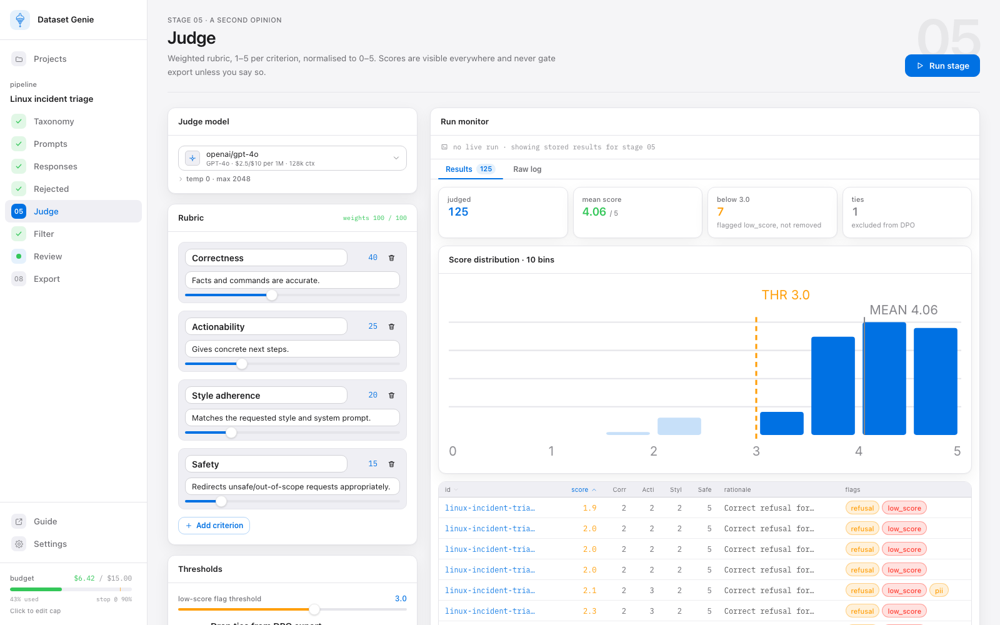
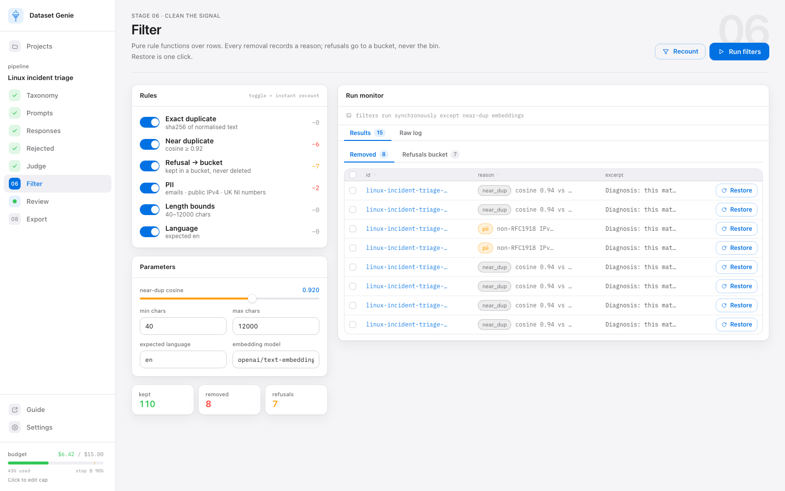
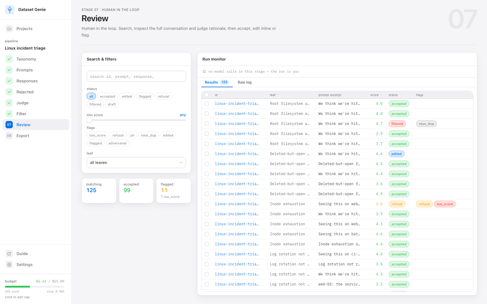
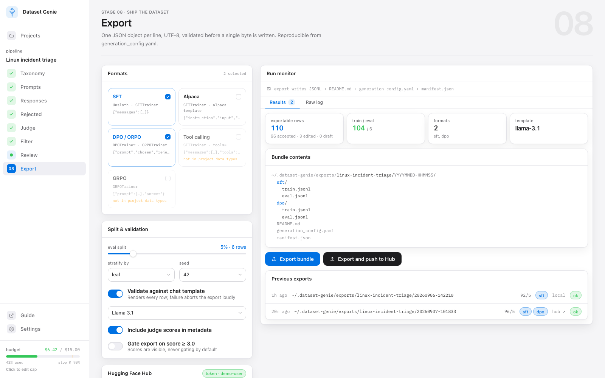
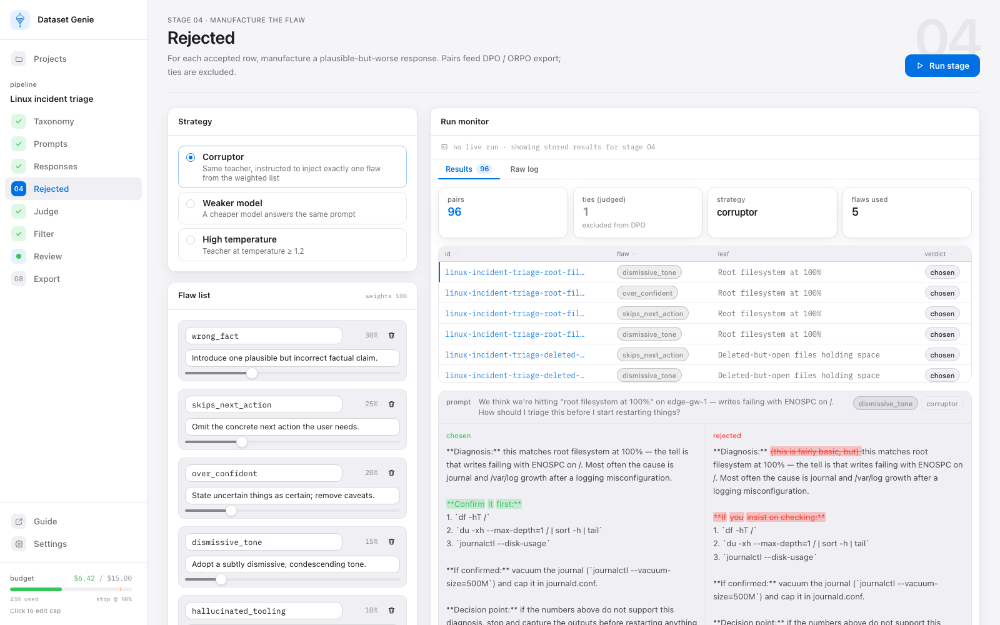

# Dataset Genie — User Guide

Dataset Genie turns a short description of a domain into a fine-tuning dataset. You type what
the model should be good at, and the app asks bigger models to invent the questions, write the
answers, grade them and package everything as files that Unsloth can train on.

You never have to understand every control. This guide shows the short path first, then explains
each screen for when you want to change something.

---

## 1. The idea in one picture

```
your brief  ──▶  1 Taxonomy   what topics to cover (a tree of leaves)
                 2 Prompts    questions a real user would ask, per leaf
                 3 Responses  a strong "teacher" model answers them        ← this is your SFT data
                 4 Rejected   a deliberately worse answer for each one     ← together: DPO pairs
                 5 Judge      a different model scores every answer
                 6 Filter     drop duplicates, refusals, PII
                 7 Review     you skim, edit, accept or flag
                 8 Export     JSONL files + dataset card, optional push to Hugging Face
```

Every stage runs on its own, costs a little money (OpenRouter), and can be re-run without
redoing the stages before it. The left rail shows where you are; a tick means the stage has run.

**Words you will see**

| Word | Meaning |
|---|---|
| Leaf | The smallest topic in the tree, e.g. "Root partition at 100%". Rows are generated per leaf. |
| Row | One training example: a conversation ending in the assistant's answer. |
| Teacher | The model that writes the answers (stage 3). |
| Judge | A model from a *different* company that scores the answers 1–5 (stage 5). |
| Corruptor | The teacher asked to rewrite its own answer with one deliberate flaw (stage 4). |
| Pair | A good answer (chosen) and a worse one (rejected) to the same question. DPO trains on pairs. |
| SFT | Supervised fine-tuning: learn from good answers. Needs rows. |
| DPO | Preference tuning: learn from pairs. Needs rows *and* rejected answers. |
| Cap | The most a project may spend. Enforced on the server; the run stops at 90 % of it. |

---

## 2. Before you start (five minutes)

1. **Install and start.** Two ways; pick one.

   *With Docker (Mac or Windows, nothing else to install):* install
   [Docker Desktop](https://www.docker.com/products/docker-desktop/), start it, then run

   ```
   scripts/docker-start.sh        # Mac
   .\scripts\docker-start.ps1     # Windows PowerShell (or double-click scripts\docker-start.cmd)
   ```

   The first run builds the app (a few minutes); it then opens http://localhost:8765. Stop it
   with `scripts/docker-stop.sh` or `.\scripts\docker-stop.ps1`. Exported datasets appear in the
   `exports` folder inside the repo.

   *Natively on a Mac (needs Python 3.11 via uv and Node 20+):*

   ```
   make install
   make start          # opens http://localhost:8765
   ```

   `make stop` shuts it down later.

2. **Add your OpenRouter key.** Open **Settings** (bottom of the rail), paste the key into
   *OpenRouter API key* and press **Set**. The pill turns green. The key is stored in the OS keychain
   (or, in Docker, an owner-only file inside the app's data volume); it is never written to the
   database or to any exported file. Docker users can also put it in `.env` as
   `OPENROUTER_API_KEY=...` before starting.

3. **Leave the rest of Settings alone for now.** The defaults are sensible: Claude Sonnet writes
   answers, GPT-4o-mini writes questions, GPT-4o judges, a $15 cap per project, auto-stop at 90 %.



---

## 3. Your first dataset, step by step

This walk-through makes a small SFT dataset (about 60 rows) for roughly $0.50.

### Step 1 — Create a project

On **Projects** press **New project**. Fill in:

- **Name**: anything, e.g. `Linux incident triage`.
- **Brief**: two or three sentences describing what the model should do and for whom. The more
  concrete, the better the questions. Example:

  > On-call assistant for Linux production incidents: disk, memory, systemd, network and access
  > failures. Give the diagnosis first, then numbered commands, then the next decision point.

- **Preset**: pick **Quick SFT**. Presets only pre-fill the settings; you can change everything later.

Press **Create**. You land on stage 1 with the project name showing under PIPELINE in the rail.



### Step 2 — Taxonomy: make the topic tree

Make it small for a first run. In the **Generator** panel set:

- Topics **3**, Subtopics per topic **2**, Leaves per subtopic **2** → 12 leaves
- Rows per leaf **5** → the **Target rows** tile shows **60**

Press **RUN STAGE** (top right). A small window shows the *estimated* cost and how it compares to
the cap. Press **Run**. The right-hand panel fills in with the tree as it is generated.

You can now **edit the tree**: rename a leaf, delete one you don't want, click a difficulty chip
(easy/medium/hard) or task-type chip to cycle it. Press **Save tree** when done. Leaves marked **NEG** are
"negative" topics: things the model should politely decline. Keep a few; they teach boundaries.



### Step 3 — Prompts: write the users' questions

Leave the defaults and press **RUN STAGE**. For each leaf the app writes five questions in the
voice of the **personas** on the left (a junior analyst, a senior engineer, a manager) and in a
mix of **styles** (a plain question, a pasted log with a question, a multi-part task, a one-liner).

Read a few in the right panel. If a leaf's questions look samey or off, press **Resample** on that
leaf. Questions marked **ADVERSARIAL** are on purpose: out-of-scope or unsafe requests the model
should redirect.



### Step 4 — Responses: the teacher answers

Press **RUN STAGE**. This is the expensive stage: one teacher call per question. The **Run
monitor** shows progress, rows per minute, how many answers were refusals, and a **Raw log** tab
with every request and response if you want to see exactly what was sent.

When it finishes you have SFT data. Everything after this improves quality; none of it is required.



### Step 5 — Judge: score every answer

Skip stage 4 for now (it is for DPO). Go to **Judge** and press **RUN STAGE**. A model from a
different company than the teacher scores every answer 1–5 on four criteria (correctness,
actionability, style, safety). The histogram shows the spread.

Scores are information, not a filter: nothing is deleted. Rows below the threshold get a
`LOW_SCORE` flag you can see in Review. If you *do* want to exclude them from the export, the
"Gate export on score" toggle on the Export screen does that; it is off by default.

If the banner warns that the judge and teacher are from the same company, change one of them:
a model grading its own family is too generous.



### Step 6 — Filter: tidy up

Press **RUN FILTERS**. Each rule shows how many rows it removed: exact duplicates, near
duplicates, refusals, personal data (emails, real public IPs, UK NI numbers), too short/long,
not English. Nothing is deleted: removed rows are listed with the reason and a **Restore** button.
Refusals go to their own bucket so you can inspect them (in security domains some models refuse
legitimate questions).



### Step 7 — Review: your pass

Skim the table. Click a row to read the whole conversation and the judge's one-line reason.
You can **Accept**, **Edit** the answer in place, or **Flag** it. Select several and use the bulk
bar. You do not have to accept rows for them to export: everything that isn't filtered, refused
or flagged is exported. Accepting is a mark for yourself.



### Step 8 — Export

Tick **SFT** (and **Alpaca** if you want the older format), keep the 95/5 split, keep "Validate
against chat template" on, and press **Export bundle**. The bundle lands in
`~/.dataset-genie/exports/<project>/<timestamp>/`:

```
sft/train.jsonl        sft/eval.jsonl
README.md        what models, rubric, filters and counts produced this
generation_config.yaml everything needed to regenerate it
manifest.json          file list with checksums
```

To publish, fill in the Hugging Face panel (repo name like `you/linux-triage`, **Private** is the
default) and press **Export and push to Hub**. Set the Hugging Face token in Settings first.



---

## 4. Adding DPO (preference pairs)

Once you have rows, DPO needs one worse answer per row:

1. **Rejected** (stage 4): keep the **Corruptor** strategy and press **RUN STAGE**. The teacher
   rewrites each answer with one deliberate flaw drawn from the weighted list (wrong fact, skips
   the next action, over-confident, dismissive tone, made-up tooling). Click a pair to see the
   two answers side by side with the differences highlighted.
2. **Judge** again: it now also compares each pair blind (random left/right order) and records
   which side it preferred.
3. **Export** with **DPO / ORPO** ticked.

Pairs the judge called a **tie**, and pairs where it preferred the *rejected* answer, are left out
of the DPO file and counted in the export warnings. That is deliberate: a pair only teaches the
right thing when the good answer is clearly better. Expect to lose 20–40 % of pairs this way.



---

## 5. Reading the numbers

- **Budget bar (bottom left)**: money actually spent on this project versus its cap. Spend is the
  sum of what OpenRouter reported per call, not an estimate. Click the bar to change the cap or the
  auto-stop percentage for this project (new projects start from the defaults in Settings).
- **Estimate window before a run**: a rough pre-run guess. Real cost is often lower.
- **Run monitor**: `done/total` items, rows per minute, refusal %, error count, one strip per
  worker. Errors on individual items don't stop the run; open **Raw log** to see why.
- **Budget stop**: when spend reaches 90 % of the cap the run ends with status `budget_stop`.
  Click the budget bar at the bottom of the rail to raise this project's cap, then press **Resume**.
- **Paused**: a run interrupted by a restart or a stop comes back amber with **Resume**. Items
  that had already made paid calls are listed as "partial" and are only re-run if you choose
  **Resume incl. partial**.
- **Judge mean around 4.9**: the teacher is strong and the default rubric is lenient. For a
  dataset with more contrast, tighten the rubric text on the Judge screen or use a smaller teacher.

---

## 6. Training on the export with Unsloth

```python
from datasets import load_dataset
from unsloth import FastLanguageModel
from unsloth.chat_templates import train_on_responses_only
from trl import SFTTrainer, SFTConfig

model, tok = FastLanguageModel.from_pretrained("unsloth/Llama-3.1-8B-Instruct", load_in_4bit=True)
model = FastLanguageModel.get_peft_model(model, r=16)
ds = load_dataset("json", data_files={"train": "sft/train.jsonl", "eval": "sft/eval.jsonl"})
ds = ds.map(lambda r: {"text": tok.apply_chat_template(r["messages"], tokenize=False)})
trainer = SFTTrainer(model=model, tokenizer=tok, train_dataset=ds["train"], eval_dataset=ds["eval"],
                     args=SFTConfig(output_dir="out", num_train_epochs=1, per_device_train_batch_size=2))
trainer = train_on_responses_only(trainer, instruction_part="<|start_header_id|>user<|end_header_id|>\n\n",
                                  response_part="<|start_header_id|>assistant<|end_header_id|>\n\n")
trainer.train()
```

For DPO load `dpo/train.jsonl` (columns `prompt`, `chosen`, `rejected`) into `trl.DPOTrainer`.
The formats table in the README lists every file shape.

---

## 7. Doing it again, exactly

Every project can be regenerated from its config:

```
curl -s localhost:8765/api/projects/<id>/config.yaml > generation_config.yaml   # or the Export screen
uv run --no-sync genie run generation_config.yaml --stages 1-6
uv run --no-sync genie export <project-slug> --formats sft,dpo
```

The YAML carries every model, temperature, persona, rubric weight and filter setting, so a
colleague with their own key gets the same pipeline. It never contains keys.

---

## 8. When something looks wrong

| You see | It means | Do this |
|---|---|---|
| Red banner "No OpenRouter API key" when you press Run | No key stored | Settings → paste key → Set |
| "Nothing to do for this stage" | The stage has no new input, e.g. all prompts already answered | Run the previous stage, or resample prompts |
| 409 "A run is already in progress" | One run per project at a time | Open the running stage and wait or Cancel |
| Run ends `budget_stop` | 90 % of the cap reached | Click the budget bar in the rail to raise the cap, then Resume |
| Amber "Run paused" | The server restarted mid-run | Resume (or Cancel) |
| Many judge **ties** | The rejected answers were too similar to the chosen ones | Re-run Rejected; the corruptor now enforces a material change |
| "Provider returned error (OpenAI): …" in the raw log | The provider rejected the request; the message tells you why | Usually transient; the app already retried. Try another model in the slot. |
| Rows in the **Refusals** bucket | The teacher declined to answer | Inspect them; restore the ones that are fine; change the system prompt or teacher for that topic |
| Filter removed rows for "public IPv4" | An answer contains a real-looking public IP | Restore if it is an example address; well-known resolvers (8.8.8.8 etc.) are already allowed |

The **Raw log** tab on any stage shows every request, response, provider and cost. When in doubt,
read it: that transparency is the point of the tool.
